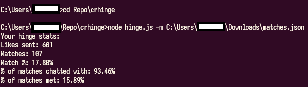

# Crhinge
Produces user match and various other statistics based on the JSON data provided by hinge when requested

## How to use
1. Navigate within the Hinge app to settings and locate the option to request your data. (will take a day or 2 for them to send it to you). In the data they send, a file "matches.json" will be included, its the one we're interested in
2. Either use git to clone this repository to your local desktop, or if you are unfamiliar with git navigate to this repository's homepage and click the green "code" button and click "Download .zip"
3. Install NodeJS: Windows -> https://nodejs.org/en/download. Linux -> use the package manager associated with your linux distro
4. If you downloaded the zip file, extract that now. Skip otherwise.
5. Open PowerShell if on windows, or Terminal on Unix based OSes, and run the command:

```powershell
# navigate to the directory that the hinge.js
# script from this repository is in ex.) if it
# was located in a directory called crhinge within Downloads directory on Windows (C:\Users\myusername\Downloads\chringe)
cd C:\Users\myusername\Downloads\chringe
# alternatively on linux and windows
cd ~\Downloads\chringe

# execute the script using the node command
node ./hinge.js -m <path/to/your/matches.json>
```

## Example

